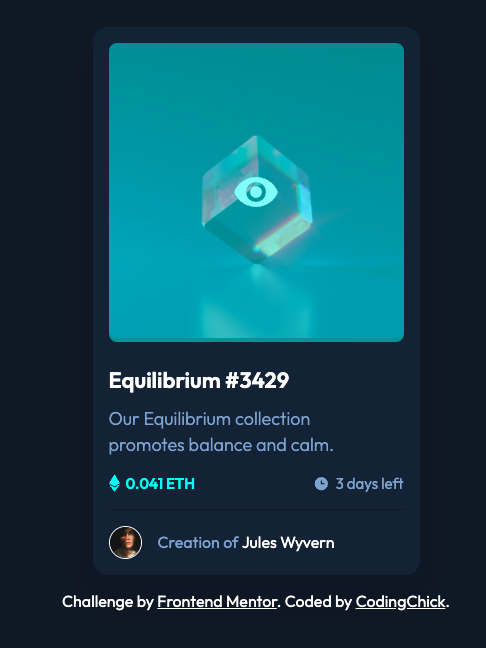

# Frontend Mentor - NFT preview card component solution<!-- omit in toc -->

## Table of contents<!-- omit in toc -->

- [Overview](#overview)
  - [The challenge](#the-challenge)
  - [Links](#links)
- [My process](#my-process)
  - [Built with](#built-with)
  - [What I learned](#what-i-learned)
- [Author](#author)

## Overview

### The challenge

Users should be able to:

- View the optimal layout depending on their device's screen size
- See hover states for interactive elements

### Links

- [GitHub repo](https://github.com/awesomeCoding999/frontend-mentor-NFT-preview)
- [Live site](https://awesomecoding999.github.io/frontend-mentor-NFT-preview/)

## My process

### Built with

- Semantic HTML5 markup
- CSS custom properties
- Flexbox
- Mobile-first workflow

### What I learned

I struggled with the hover overlay on the image for a bit but it feels good to arrive at a solution.

## Author

- Frontend Mentor - [@awesomeCoding999](https://www.frontendmentor.io/profile/awesomeCoding999)
